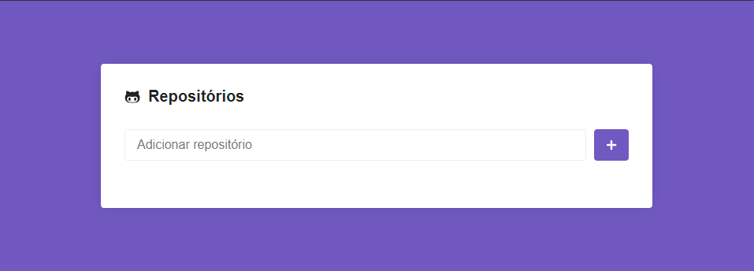
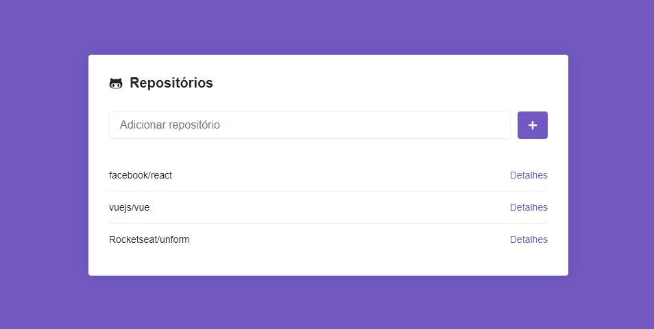
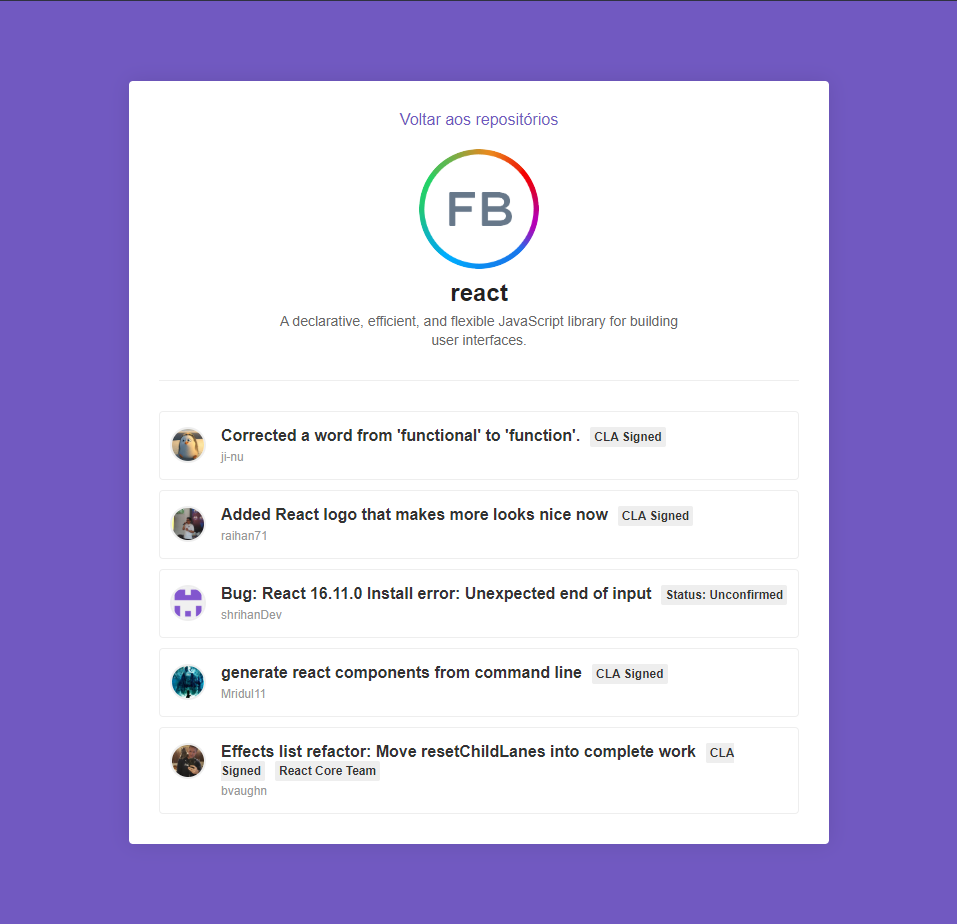

<h1 align="center">Github Repositories </h1>

<h4 align="center">

 

</h4>

<h3 align="center">
  This application was developed with ReactJS, consuming API from github for detailing the information of the repositories.
</h3>

  

  

  

  

  <a href="#description">Description</a>&nbsp;&nbsp;&nbsp;|&nbsp;&nbsp;&nbsp;
  <a href="#technologies">Technologies</a>&nbsp;&nbsp;&nbsp;|&nbsp;&nbsp;&nbsp;
  <a href="#objective">Project's goal</a>&nbsp;&nbsp;&nbsp;|&nbsp;&nbsp;&nbsp;
  <a href="#result">Result</a>

 

<h2 id="description" name="description">
📝 Description
</h2>

This application is created according to the teachings of <a href="https://rocketseat.com.br/">Rocketseat</a>, focusing on the front-end, to put into practice the teachings about ReactJS and other dependencies, such as Axios for API consumption and Styled Components for style.

 

<h2 id="technologies" name="technologies">
🚀 Technologies
</h2>

- [ReactJS](https://pt-br.reactjs.org/)
- [React dom](https://pt-br.reactjs.org/docs/react-dom.html)
- [React router dom](https://reactrouter.com/web/guides/quick-start)
- [React icons](https://react-icons.github.io/react-icons/)
- [Axios](https://github.com/axios/axios)
- [Styled Components](https://styled-components.com/)
- [Eslint](https://eslint.org/)
- [Prettier](https://prettier.io/)

 

<h2 id="objective" name="objective">
🎯 Project's goal
</h2>

It was very exciting to learn more about this world of react, and all the tools used in this project, which propelled me to a new understanding, even though it was a project followed by video lessons, I was able to challenge myself to understand old concepts, to improve the perception for new ones concepts, which will be used in future projects.

 

<h2 id="result" name="result">
✅ Result
</h2>

#### Main screen
<h5 align="center">

#### Main screen adding repository

<h5 align="center">

#### Repositories screen

<h5 align="center">

 

 

Made with 🧡 By Elivelton Ferreira. [Get in touch!](https://www.linkedin.com/in/eliveltonsf/) :calling:
